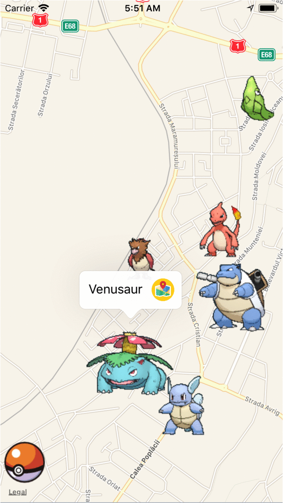
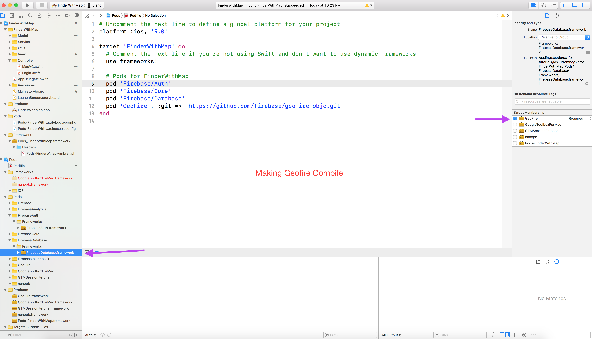

# FinderWithMap

An example using Devslopes PokeFider tutorial, plus the option to select the photo by placing a pin and add the photo from a collection

### Configuration
Geofire needs FirebaseDatabase framework for compiling:

